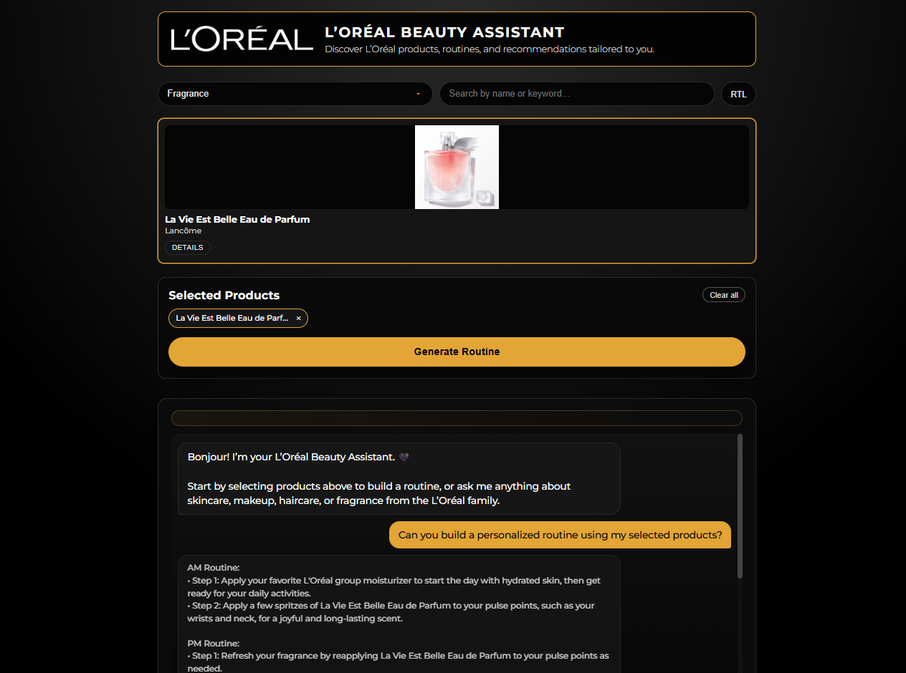

# 💄 L’Oréal AI Beauty Assistant

An AI-powered web application that helps users explore L’Oréal group products and generate personalized beauty routines using natural language interaction.

The project combines a modern frontend, structured product data, and a serverless AI backend to demonstrate real-world AI integration in a web application.

---

---

## ✨ Overview

The L’Oréal AI Beauty Assistant allows users to discover products and build routines tailored to their needs.

Users can:
- Browse and filter products across L’Oréal group brands (skincare, makeup, haircare, fragrance)
- Select products to create a personalized routine
- Chat with an AI assistant for product explanations and usage guidance
- Receive clear, step-by-step recommendations in a conversational format

The focus of this project is **AI integration**, **API security**, and **user-centered design**.

---

## 🚀 Key Features

- **AI-Powered Chatbot**
  - Natural language interface for beauty-related questions
  - Multi-turn conversation support for contextual recommendations
  - Responses constrained to L’Oréal group brands and beauty topics

- **Personalized Routine Generation**
  - Uses user-selected products as structured context
  - Generates simple, easy-to-follow routines
  - Adapts guidance based on product category and usage

- **Secure Serverless Architecture**
  - AI requests routed through a Cloudflare Worker
  - API keys securely stored server-side (never exposed to the client)
  - Uses Groq’s OpenAI-compatible API for fast LLM inference

- **Interactive Product Browsing**
  - Category filtering and live search
  - Persistent product selection using browser localStorage
  - Clean, responsive product grid layout

- **Accessibility & Global Readiness**
  - Responsive design for desktop and mobile
  - Optional right-to-left (RTL) layout support
  - Clear visual hierarchy and readable UI components

---

## 🛠️ Technical Stack

- **Frontend:** HTML, CSS, JavaScript (ES6)
- **AI / LLM:** Groq (OpenAI-compatible Chat Completions API)
- **Backend / Proxy:** Cloudflare Workers
- **Data:** JSON-based product catalog
- **State Management:** Browser localStorage

---

## 🧩 Architecture Notes

- The frontend sends structured conversation data as a `messages` array.
- Requests are proxied through a Cloudflare Worker, which securely forwards them to the Groq API.
- The system prompt constrains responses to beauty-related topics and L’Oréal group brands.
- The architecture mirrors production patterns used to safely integrate AI services in client-facing applications.

---

## ⚠️ Disclaimer

This project is a **demonstration application built for learning purposes**.  
It is **not an official L’Oréal product or service**.

---

## 👤 Author

**Shivraj Jadeja**  
Software Engineering Apprentice – Global Career Accelerator
